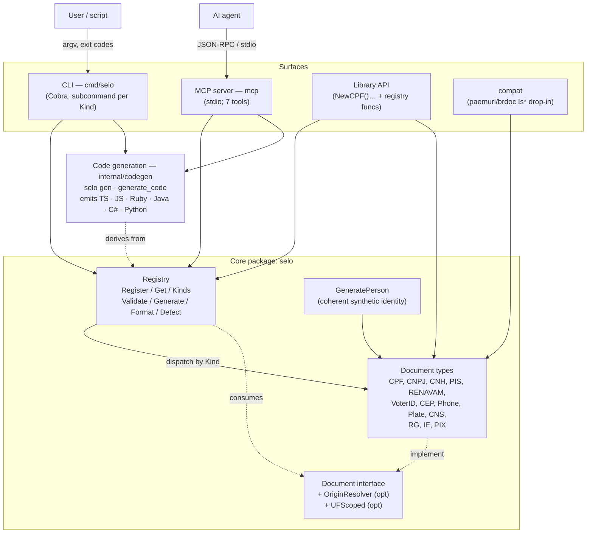
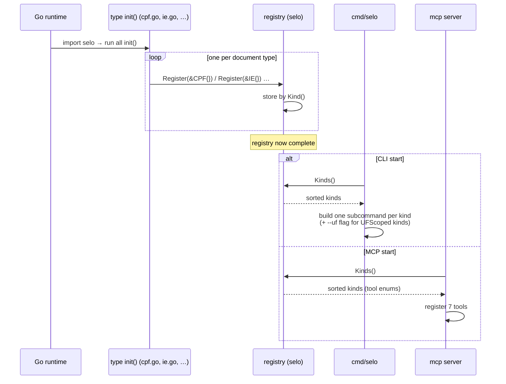
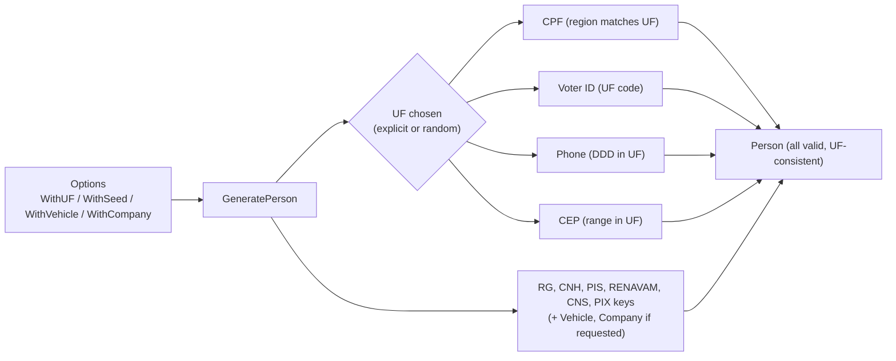
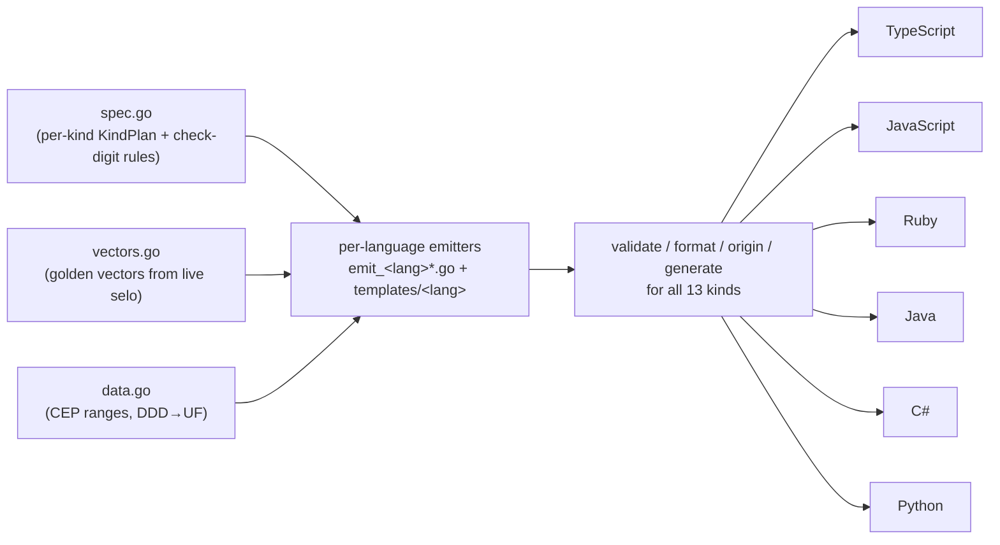

# Architecture

`github.com/inovacc/selo` is a Go toolkit for Brazilian documents exposed through three surfaces
(library, CLI, MCP server) over one core: a `Document` interface plus a self-registering type
registry. The CLI and MCP server derive their entire surface from the registry, so adding a
document type requires no changes to them.

## System overview



## Type registration lifecycle

Each document type registers itself at package-init time; the registry is fully populated before
`main` runs, so the CLI and MCP build their surfaces from `Kinds()`.



## Validate request flow (CLI)

```mermaid
sequenceDiagram
    participant U as User/script
    participant CLI as cmd/selo
    participant Reg as registry
    participant Doc as Document (e.g. CPF/RG)

    U->>CLI: selo cpf --validate 529.982.247-25
    CLI->>Reg: Validate(KindCPF, value)
    Reg->>Reg: Get(KindCPF)
    Reg->>Doc: Validate(value)
    Doc->>Doc: clean + check digits
    Doc-->>Reg: bool
    Reg-->>CLI: (bool, err)
    alt valid
        CLI-->>U: "valid" (exit 0)
    else invalid or error
        CLI-->>U: "invalid" (exit 1)
    end

    Note over CLI,Doc: UF-scoped kinds (RG, IE) with --uf call ValidateUF(value, uf);<br/>unsupported UF → ErrUFNotImplemented
```

## MCP tool-call flow

```mermaid
sequenceDiagram
    participant Agent as AI agent
    participant MCP as mcp server (stdio)
    participant Reg as registry
    participant Doc as Document

    Agent->>MCP: call validate_document {kind, value}
    MCP->>Reg: Validate(kind, value)
    Reg->>Doc: Validate(value)
    Doc-->>Reg: bool
    Reg-->>MCP: (bool, err)
    alt err (e.g. unknown kind)
        MCP-->>Agent: result.IsError = true ("selo mcp: …")
    else ok
        MCP-->>Agent: TextContent {valid: bool}
    end
    Note over MCP: logs → stderr; JSON-RPC → stdin/stdout
```

## Synthetic identity (GeneratePerson)



## Code generation

`selo gen` (and the MCP `generate_code` tool) emit standalone validators in other languages from
the *same* verified Go algorithms. The `internal/codegen` package holds a declarative per-kind spec
and Go-produced golden vectors; per-language emitters render an installable module plus a test suite
for each target. A CI matrix runs every target's golden vectors on its real toolchain, so a wrong
port fails its own tests.



See [CODEGEN.md](CODEGEN.md).

## Packages

| Package | Path | Responsibility |
|---------|------|----------------|
| core | `github.com/inovacc/selo` | `Document` interface, registry, all document types, `GeneratePerson`, errors |
| CLI | `cmd/selo` | Cobra CLI; registry-derived subcommands; `detect`, `person`, `gen`, `mcp`, `version` |
| MCP | `mcp` | stdio Model Context Protocol server; 7 registry-backed tools |
| compat | `compat` | drop-in mirror of `paemuri/brdoc` v3 `Is*` API + signature-parity guard |
| codegen | `internal/codegen` | multi-language code generation (spec + golden vectors + per-language emitters) backing `selo gen` and the `generate_code` MCP tool |

## Key design decisions
See the ADRs: [interface + registry architecture](adr/0001-interface-registry-architecture.md) and
[paemuri compat layer](adr/0002-paemuri-compat-layer.md).
